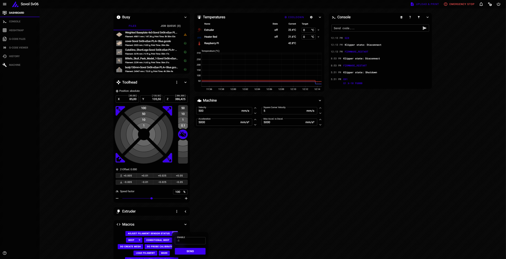
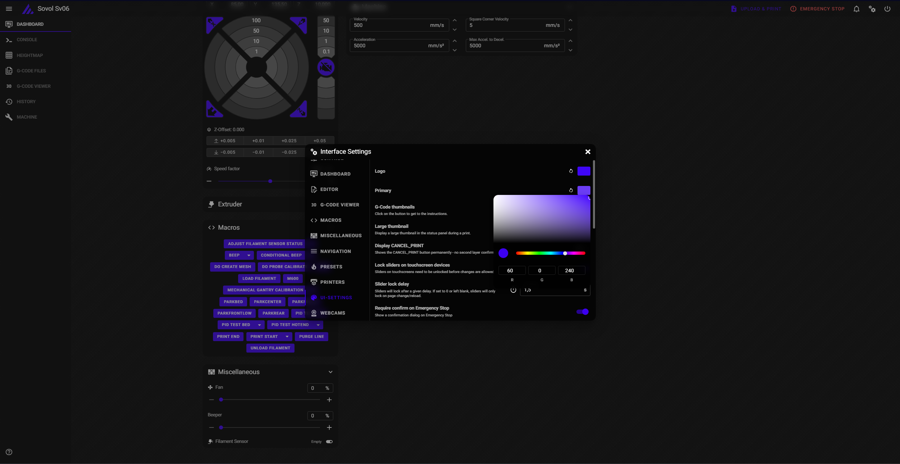
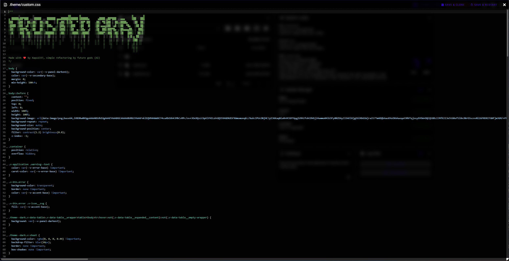

# Spade
Spade is a minimalistic mainsail theme based on Frosted Gray, but with V1E.com markings for the MP3DP v4/v5(spade) printer

Modified from [acryl theme for fluidd & mainsail](https://github.com/eliteSchwein/acryl-fluidd-mainsail-theme/) (fluidd is not supported in this theme, future versions will remove the old fluidd css code as its not needed. cbf to do now)

